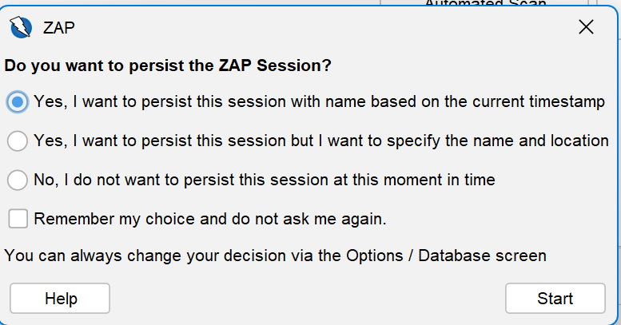
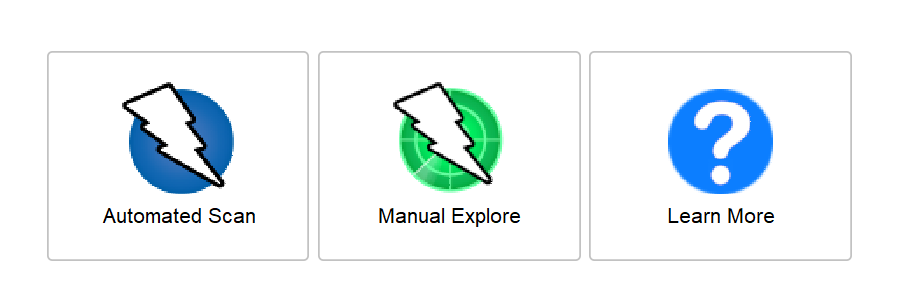
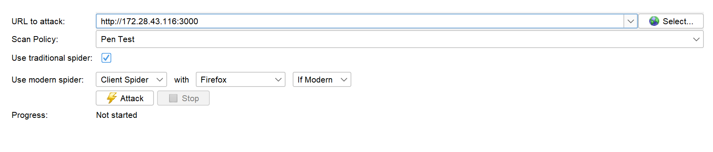

To thoroughly scan networks, operating systems, web apps, and databases, you need a multi-tool approach because no single open-source tool excels at all four layers.
## Recommended Open-Source Scanner Matrix

| Target Layer | Recommended Tool | Strengths & Focus |
|---|---|---|
| Network & OS | OpenVAS / Nmap | Port scanning, OS fingerprinting, and device vulnerability assessment. |
| Web Application | OWASP ZAP | Finding OWASP Top 10 vulnerabilities (SQLi, XSS, broken auth) via active/passive scanning. |
| Database | sqlmap / Hexway DB-Scanner | Deep scanning for SQL injection and database structure exploitation. |

------------------------------
## Layer-by-Layer Tool Breakdown## Network & Operating System (OS) Scanning

* OpenVAS (Greenbone Community Edition): The closest open-source equivalent to commercial tools like Nessus. It runs deep authenticated scans on Linux/Windows hosts to find missing OS patches and open network vulnerabilities.
* Nmap (with NSE scripts): While primarily a network mapper, its Nmap Scripting Engine (NSE) contains hundreds of scripts to detect specific network vulnerabilities and identify outdated OS versions.

## Web Application Scanning

* OWASP ZAP (ZAP Proxy): The industry standard for open-source web application security testing. It can intercept traffic, spider websites, and perform automated active scanning against web forms and APIs.
* Nuclei: A highly customizable, fast tool that uses community-driven YAML templates to find specific CVEs and misconfigurations in modern web architectures.

## Database Scanning

* sqlmap: An open-source tool that automates the process of detecting and exploiting SQL injection flaws, allowing you to audit database backend configurations and access controls.
* Database-Specific Auditing Tools: Tools like Oat (Oracle Assessment Tool) or specialized NSE scripts within Nmap are best for scanning specific open database ports (e.g., MySQL on port 3306 or PostgreSQL on 5432).

------------------------------
## Actionable Starting Point
If you want to start scanning immediately without complex installations, Nmap and OWASP ZAP are the fastest ways to gain initial visibility.

   1. For Network/OS: Run a basic vulnerability scan on your subnet using Nmap's built-in script library:
   
   > nmap -sV --script vuln "target-ip-or-subnet"
   
   2. For Web Apps: Download the OWASP ZAP Desktop GUI, enter your web application's URL into the "Quick Start" tab, and click Attack to run an automated baseline scan.

To help narrow down the deployment setup, let me know:

* What operating system will you be hosting these scanners on? (e.g., Kali Linux, Ubuntu, Windows)
* Are you looking to automate these scans in a pipeline (like GitHub Actions or GitLab CI/CD) or run them as one-off manual assessments?

# How to setup

1. Download ZAP proxy from the URL https://www.zaproxy.org/download/ (OR) Alternatively you can install on kali-linux using the below command.
> sudo apt install zaproxy' on kali-linux.
2. Install npm and nodejs on Kali Linux 

> sudo apt install npm ( This installs both npm and nodejs)

3. Download 'Juiceshop' a deliberately vulnerable web application for testing and practice developed by OWASP.

> https://github.com/juice-shop/juice-shop/releases/tag/v20.2.0 

4. Scroll down to get the latest version for your platform. Download juice-shop-<version>_<node-version>_<os>_x64.zip (or .tgz) attached to latest release
5. Unpack and cd into the unpacked folder
> Run npm start

6. Browse to http://localhost:3000 through your browser to confirm website is up and running

7. Launch ZAP proxy

 and click on 'Start'

8. Click on Automated Scan

9. Fill in the IP address of the machine in which Juice shop is running and Click on Attack

10. Wait for the scan to complete and then click on Generate report from the top menu.

The menu will be generated as html. A sample report can be accessed below

