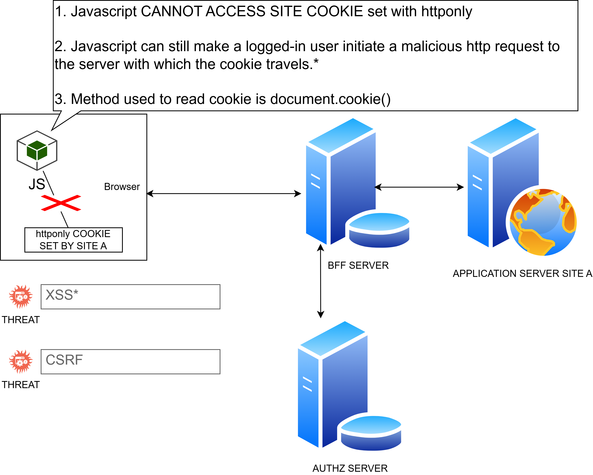

# Weakest link in a Backend for Frontend (BFF) architecture

The application relies on an ,  session cookie to establish authentication between the browser (SPA) and the BFF. While this protects tokens from direct theft via Cross-Site Scripting (XSS), the cookie itself acts as the architecture's weakest link in two specific ways: Cross-Site Request Forgery (CSRF) exposure and Session Hijacking via Proxy Abuse. [1, 2, 3]  

# The Vulnerabilities of the Cookie Link 

> The CSRF Attack Surface Because browsers automatically append cookies to outbound HTTP requests matching the target domain, shifting from local storage tokens to cookies reintroduces the threat of Cross-Site Request Forgery (CSRF). If a user visits a malicious site while authenticated, that site can trick the user's browser into firing off unauthorized requests to your BFF, carrying the session cookie along with it. [3, 4] 

 > Session Hijacking & Proxy Abuse (The Ultimate Weak Link) Even when using  to prevent JavaScript from reading the cookie value, an XSS vulnerability on the frontend still allows an attacker to abuse the cookie. Since the BFF serves as a reverse proxy that exchanges the session cookie for real downstream bearer tokens, an attacker who has injected malicious scripts into the frontend can execute a browser-resident attack: 

### Note: 
JavaScript cannot steal the cookie string, but it can still make fetch/axios requests to the BFF from within the authenticated browser session. The BFF will happily accept these requests, append the valid microservice access tokens, and execute them on behalf of the attacker. [1]  

# How to Harden the Weakest Link 
To counteract the inherent weaknesses of cookie-based BFF communication, developers must implement layered security controls: [6]  

| Mitigation Strategy | How It Works | Threat Solved  |
| --- | --- | --- |
|  SameSite=Strict or Lax| Restricts the browser from sending the cookie during cross-site requests. | CSRF  |
| Anti-CSRF Tokens | Requires the frontend to pass a custom cryptographic token in a custom header (e.g., ) that JavaScript can read, which the BFF validates against the session. | CSRF  |
| Strict Content Security Policy (CSP) | Restricts where the browser can load scripts from, utilizing nonces to stop unauthorized script execution entirely. | XSS & Proxy Abuse  |
| Token Binding / Context Checks | The BFF validates incoming requests against behavioral markers (e.g., matching client IP shifts, JA3 fingerprints, or device identifiers). | Session Exfiltration  |

# How it Protects Against Direct Theft 

* Blocked Access: The  flag instructs the browser that the cookie is restricted to server-side communications. 
* Invisible to Scripts: Client-side JavaScript running in the browser cannot access or return an  cookie via . 
* Stored vs. Reflected: Whether the XSS is stored, reflected, or DOM-based does not change this browser-level restriction on JavaScript execution. 

# Links

[1] https://github.com/openiddict/openiddict-samples/issues/180
[2] https://stevekinney.com/courses/enterprise-ui/authentication-and-authorization
[3] https://moonsat.medium.com/the-backend-for-frontend-bff-pattern-secure-auth-done-right-4afdb2847c5d
[4] https://capturethebug.xyz/blogs/Modern-Frontend-Security-Protecting-Your-Application-Beyond-XSS-and-CSRF-in-2025
[5] https://docs.duendesoftware.com/bff/architecture/
[6] https://nhimg.org/glossary/httponly-cookie/

# How Attackers Still Exploit Stored XSS with  Cookies 

Even though the cookie value cannot be read directly, a stored XSS payload still executes inside the victim's authenticated session. An attacker can bypass the need to "steal" the cookie by making the browser perform actions on the user's behalf: 

* Making Authenticated Requests: The browser automatically attaches  cookies to any background network requests (like  or ) or form submissions sent to the server. 
* Privilege Escalation / Actions: The malicious script can perform unauthorized actions within the application as the victim, such as changing the user's password, creating new admin accounts, or exfiltrating other non-protected data visible in the DOM. 
* Server-Side Leakage Endpoints: If the application has an endpoint that echoes the session token or sensitive profile information back in an API response or page content via an authenticated request, the script can read that response and send it to an attacker-controlled server. [3]  

[1] https://thecyberneh.medium.com/the-illusion-of-safety-exploiting-xss-beyond-httponly-cookies-b81c6493bb76
[2] https://clerk.com/docs/guides/secure/best-practices/xss-leak-protection
[3] https://www.praetorian.com/blog/httponly-cookie-bypass-xss-ghostscript-rce/

# httponly flag

JavaScript cannot access an cookie because the browser's native engine blocks client-side script access to it entirely via , independently of Content Security Policy (CSP) or the Same-Origin Policy (SOP). [1, 2]  
Why JavaScript is Blocked 

* HttpOnly Flag: This attribute explicitly instructs the browser to restrict cookie exposure strictly to underlying HTTP network requests. Client-side APIs like  return an empty or filtered string missing that cookie. 
* Role of CSP & SOP: 

    - SOP controls how different websites or origins interact with data and resources. 
	- CSP restricts where scripts can load from and execute, mitigating Cross-Site Scripting (XSS). 
	- Neither SOP nor CSP defines cookie visibility; rather, the  flag is the direct mechanism that stops JavaScript from reading sensitive session values. [2, 4]  

# Note:
HttpOnly will still be sent with JavaScript-initiated requests, for example, when calling XMLHttpRequest.send() or fetch(). This mitigates attacks against cross-site scripting (XSS).

[1] https://stackshield.io/blog/laravel-session-security-configuration
[2] https://nzaisecurity.com/resource-library/secure-cookie-flags/
[3] https://developer.mozilla.org/en-US/docs/Web/HTTP/Guides/Cookies
[4] https://www.echoapi.com/blog/xss-attacks-how-hackers-turn-your-website-into-an-apocalypse-how-to-defend-against-it/

