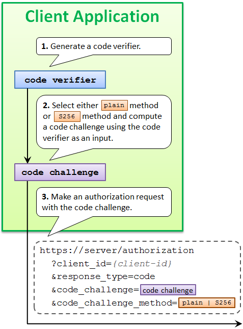

> ## Documentation Index
> Fetch the complete documentation index at: https://developers.authlete.com/llms.txt
> Use this file to discover all available pages before exploring further.

# Proof Key for Code Exchange (RFC 7636)

> This document describes PKCE, a countermeasure agains the authorization code interception attack, defined in RFC 7636.

<Note>
  This page is for Authlete 3.0. For 2.x, see [this page](/v2/protocols-and-flows/protocol-extensions/pkce).
</Note>

## 1. Introduction

[RFC 7636](http://tools.ietf.org/html/rfc7636) : **Proof Key for Code Exchange** (PKCE, pronounced "pixy") is a specification about a countermeasure against the **authorization code interception attack**.


The specification was released on September, 2015. It has added:

1. `code_challenge` parameter and `code_challenge_method` parameter to authorization requests using the authorization code flow, and
2. `code_verifier` parameter to token requests that correspond to the authorization requests.

This mechanism enables an authorization server to reject a token request from a malicious application that does not have a code verifier.

## 2. PKCE Authorization Request

### 2.1 Request Parameters

An authorization request that uses PKCE goes out with `code_challenge` parameter and optionally with `code_challenge_method` parameter.

### 2.2 Code Challenge Value

The value of code\_challenge parameter is computed by applying a code challenge method (= computation logic) to a code verifier.

### 2.3 Code Verifier Value

A code verifier itself is a random string using characters of `[A-Z] / [a-z] / [0-9] / "-" / "." / "_" / "~"`, with a minimum length of 43 characters and a maximum length of 128 characters.



### 2.4 Code Challenge Method

The defined code challenge methods are `plain` and `S256`. Respective computation logics to convert a code verifier into a code challenge are as follows.

| Method  | Logic                                                             |
| ------- | ----------------------------------------------------------------- |
| `plain` | code\_challenge = code\_verifier                                  |
| `S256`  | code\_challenge = BASE64URL-ENCODE(SHA256(ASCII(code\_verifier))) |

The `plain` method does not change the input, so the value of `code_verifier` and the resultant value of `code_challenge` are equal.

The `S256` method computes the SHA-256 hash of the input and then encodes the hash value using Base64-URL. For example, when the value of `code_verifier` is dBjftJeZ4CVP-mB92K27uhbUJU1p1r\_wW1gFWFOEjXk, the value of `code_challenge` becomes E9Melhoa2OwvFrEMTJguCHaoeK1t8URWbuGJSstw-cM.

When the used code challenge method is `S256`, a client application must tell it by including `code_challenge_method=S256` parameter in an authorization request. When `code_challenge_method` parameter is omitted, an authorization server assumes `plain` as the default value.

## 3. PKCE Authorization Response

After generating an authorization code, an authorization server saves it into its DB with the code challenge and the code challenge method contained in the authorization request.

The authorization server will use the saved code challenge and the code challenge method later to verify a token request from the client application.

A response from the authorization endpoint has nothing special for PKCE. It's a normal response as usual.


## 4. PCKE Token Request

After receiving an authorization code from an authorization server, a client application makes a token request. In addition to the authorization code, the token request must include the code verifier used to compute the code challenge.

The name of the request parameter to specify a code verifier is `code_verifier`.


## 5. PKCE Token Response

### 5.1 Require Code Verifier

A token endpoint of an authorization server that supports PKCE checks whether a token request contains a valid code verifier.

Of course, this check is performed only when grant\_type is authorization\_code and the authorization code contained in the token request is associated with a code challenge.

If a token request does not contain a valid code verifier although the conditions above meet, the request is regarded as from a malicious application and the authorization server returns an error response.

### 5.2 Verify Code Verifier

Verification is performed by comparing two code challenges.

One is what was contained in the *authorization* request and is stored in the DB. The other is what an authorization server computes using the code verifier contained in the *token* request and the code challenge method stored in the DB.

If the two code challenges are equal, the token request can be regarded as from the legitimate client application that has made the original authorization request. Otherwise, the token request must be regarded from a malicious application.

### 5.3 Issue Access Token

If a token request is verified, an authorization server issues an access token as usual.


## 6. Try PKCE With Authlete

### 6.1 Preparation

#### 6.1.1 Sign up

If you don't have an Authlete account yet, you can [sign up here](https://login.authlete.com/signup) for free. It only takes 5  minutes.


#### 6.1.2 Service ID  and Client ID

To make an authorization request, you will need a **Service ID** and a **Client ID**.

If you need a **Service ID** and a **Client ID**, follow the [Quick Setup Guide](/get-started/quickstarts/using-demo-authorization-server) to setup your service and client.

Also, you can find the **Service** and **Client** ID the [Authlete Management Console](https://console.authlete.com/).

#### 6.1.3 Service and Client Settings

This section explains how to configure your service and client settings.

Table. Service Settings

| Screen                                                   | Parameter                | Value                        |
| -------------------------------------------------------- | ------------------------ | ---------------------------- |
| Service Settings > Endpoints > Global Settings > General | Supported Grant Types    | Include `AUTHORIZATION_CODE` |
| Service Settings > Endpoints > Global Settings > General | Supported Response Types | Include `CODE`               |

Configure the service:

1. Navigate to **Service Settings > Endpoints > Global Settings > General**.
2. Under **Select Supported Grant Types**, select `AUTHORIZATION_CODE`.
3. Under **Select Response Types**, select `CODE`.
4. Click **Save Changes** to apply the updates.


Table. Client Settings

| Screen                                                  | Parameter                | Value                                       |
| ------------------------------------------------------- | ------------------------ | ------------------------------------------- |
| Client Settings > Basic Settings > General              | Client Type              | Select `PUBLIC`                             |
| Client Settings > Basic Settings > General              | Redirect URIs            | `https://client.example.org/cb/example.com` |
| Client Settings > Endpoints > Global Settings > General | Supported Grant Types    | Include `AUTHORIZATION_CODE`                |
| Client Settings > Endpoints > Global Settings > General | Supported Response Types | Include `CODE`                              |

Configure Client Basic Settings:

1. Navigate to **Client Settings > Basic Settings > General**.
2. Under **Client Type**, choose the `PUBLIC` radio button.
3. Under **Redirect URIs**, click **Add** and register the URI your client receives the response on. This page uses `https://client.example.org/cb/example.com`.
4. Click **Save Changes** to apply the updates.


Configure Client Endpoints:

1. Navigate to **Client Settings > Endpoints > Global Settings > General**.
2. Under **Select Grant Types**, select `AUTHORIZATION_CODE`.
3. Under **Select Response Types**, select `CODE`.
4. Click **Save Changes** to apply the updates.


### 6.2. Authorization Request

#### 6.2.1. Authorization Endpoint Request

As explained in \[OAuth2 Basic], Authlete's authorization API can validate authorization requests received by the authorization server on its behalf. Use the following `curl` command to make an authorization request from Authorization Server to the Authlete API. Make sure to replace `<Service ID>`, `<Service Access Token>`, `<Client ID>` and `<Ticket>` with your values.

```bash theme={null}
# Linux/Mac
curl -v -X POST "https://us.authlete.com/api/<Service ID e.g. 10738933707579>/auth/authorization" \
     -H "Authorization: Bearer <Service Access Token e.g. Xg6jVpJCvsaXvy2ks8R5WzjdMYlvQqOym3slDX0wNhQ>" \
     -H "Content-Type: application/json" \
     -d '{ "parameters": "response_type=code&client_id=<Client ID e.g. 26478243745571>&redirect_uri=https%3A%2F%2Fclient.example.org%2Fcb%2Fexample.com&code_challenge=E9Melhoa2OwvFrEMTJguCHaoeK1t8URWbuGJSstw-cM&code_challenge_method=S256" }'


# Windows (PowerShell)
curl.exe -v -X POST "https://us.authlete.com/api/<Service ID e.g. 10738933707579>/auth/authorization" `
      -H "Authorization: Bearer <Service Access Token e.g. Xg6jVpJCvsaXvy2ks8R5WzjdMYlvQqOym3slDX0wNhQ>" `
      -H "Content-Type: application/json" `
      -d '{ \"parameters\": \"response_type=code&client_id=<Client ID e.g. 26478243745571>&redirect_uri=https%3A%2F%2Fclient.example.org%2Fcb%2Fexample.com&code_challenge=E9Melhoa2OwvFrEMTJguCHaoeK1t8URWbuGJSstw-cM&code_challenge_method=S256\" }'
```

Note that the request contains `code_challenge` parameter and `code_challenge_method` parameter. To implement PKCE, you need  include and test these parameters.

#### 6.2.2 Authorization Response

If the request is valid, Authlete returns a response like this:

```json theme={null}
{
    "action": "INTERACTION",
    "resultCode": "A004001",
    "resultMessage": "[A004001] Authlete has successfully issued a ticket to the service (API Key = 933860280) for the authorization request from the client (ID = 2800496004). [response_type=code, openid=false]",
    "ticket": "cElOaH9j4mS6AiIGR9oLqHlDn9jpvcNjqSgyRqfcmAE",
    "client": {...},
    "service": {...},
}
```

Assuming that the resource owner has already been authenticated and has obtained consent, the authorization server calls the issue endpoint to obtain an authorization code. To make a token request, execute the following `curl` command. Make sure to replace `<Service ID>`, `<Service Access Token>`, `<Client ID>` and `<Ticket>` with your values.

```bash theme={null}
# Linux/Mac
curl -X POST "https://us.authlete.com/api/<Service ID e.g. 10738933707579>/auth/authorization/issue" \
     -H "Authorization: Bearer <Service Access Token e.g. Xg6jVpJCvsaXvy2ks8R5WzjdMYlvQqOym3slDX0wNhQ>" \
     -H "Content-Type: application/json" \
     -d '{ "ticket": "<Ticket e.g. cElOaH9j4mS6AiIGR9oLqHlDn9jpvcNjqSgyRqfcmAE>","subject": "testuser01"}'

# Windows (PowerShell)
curl.exe -X POST "https://us.authlete.com/api/<Service ID e.g. 10738933707579>/auth/authorization/issue" `
     -H "Authorization: Bearer <Service Access Token e.g. Xg6jVpJCvsaXvy2ks8R5WzjdMYlvQqOym3slDX0wNhQ>" `
     -H "Content-Type: application/json" `
     -d '{ \"ticket\": \"Ticket e.g. cElOaH9j4mS6AiIGR9oLqHlDn9jpvcNjqSgyRqfcmAE\",\"subject\": \"testuser01\"}'
```

If the request is valid, Authlete generates the following response.

```json theme={null}
{
    "action": "LOCATION",
    "authorizationCode": "ILePyGjraVgeU_fzaQRfd0gv10pzxgcpHY_vHT2dsPI",
    "idToken": null,
    "jwtAccessToken": null,
    "responseContent": "https://client.example.org/cb/example.com?code=ILePyGjraVgeU_fzaQRfd0gv10pzxgcpHY_vHT2dsPI&iss=https%3A%2F%2Fauthlete.com",
    "resultCode": "A040001",
    "resultMessage": "[A040001] The authorization request was processed successfully.",
    "ticketInfo": {}
}
```

### 6.3 Token Request

#### 6.3.1 Token Request with CURL

We assume the authorization server makes a redirection response to the user agent, and then the user agent makes the following HTTP GET request to the client.

```bash theme={null}

GET /cb/example.com?code=ILePyGjraVgeU_fzaQRfd0gv10pzxgcpHY_vHT2dsPI HTTP/1.1
Host: client.example.org
```

To make a token request, execute the following `curl` command. Make sure to replace `<Service ID>`, `<Service Access Token>`, `<Client ID>` and `<Code>` with your values.

```bash theme={null}
# Linux/Mac
curl -v -X POST https://us.authlete.com/api/<Service ID e.g. 10738933707579>/auth/token \
-H 'Content-Type: application/json' \
-H 'Authorization: Bearer <Service Access Token e.g. Xg6jVpJCvsaXvy2ks8R5WzjdMYlvQqOym3slDX0wNhQ>' \
-d '{ "parameters": "grant_type=authorization_code&code=<Code e.g. ILePyGjraVgeU_fzaQRfd0gv10pzxgcpHY_vHT2dsPI>&redirect_uri=https%3A%2F%2Fclient.example.org%2Fcb%2Fexample.com&code_verifier=dBjftJeZ4CVP-mB92K27uhbUJU1p1r_wW1gFWFOEjXk", "clientId": "<Client ID e.g. 26478243745571>" }'

# Windows (PowerShell)
curl.exe -v -X POST https://us.authlete.com/api/<Service ID e.g. 10738933707579>/auth/token `
  -H "Content-Type: application/json" `
  -H "Authorization: Bearer <Service Access Token e.g. Xg6jVpJCvsaXvy2ks8R5WzjdMYlvQqOym3slDX0wNhQ>" `
  -d '{\"parameters\": \"grant_type=authorization_code&code=<Code e.g. ILePyGjraVgeU_fzaQRfd0gv10pzxgcpHY_vHT2dsPI>&redirect_uri=https%3A%2F%2Fclient.example.org%2Fcb%2Fexample.com&code_verifier=dBjftJeZ4CVP-mB92K27uhbUJU1p1r_wW1gFWFOEjXk\", \"clientId\": \"<Client ID e.g. 26478243745571>\" }'
```

#### 6.3.2. Token Response

If the authorization code and the code verifier you entered are valid, an access token is returned in the form of JSON like the following.

```json theme={null}
{
   "resultMessage" : "[A050001] The token request (grant_type=authorization_code) was processed successfully.",
   "action" : "OK",
   "clientIdAliasUsed" : false,
   "subject" : "testuser01",
   "resultCode" : "A050001",
   "grantType" : "AUTHORIZATION_CODE",
   "accessToken" : "7FfwOnGjVHwxXhs2Wr67XV1-ZhQaoy3ctKcGkLyKxuY",
   "refreshToken" : "T1h7fJ6k55CyipDtXNPbzN8ta3FgAAf4QKjo36OVfIE",
   "responseContent" : "{\"access_token\":\"7FfwOnGjVHwxXhs2Wr67XV1-ZhQaoy3ctKcGkLyKxuY\",\"token_type\":\"Bearer\",\"expires_in\":86400,\"scope\":null,\"refresh_token\":\"T1h7fJ6k55CyipDtXNPbzN8ta3FgAAf4QKjo36OVfIE\"}",
   "accessTokenDuration" : 86400,
   "accessTokenExpiresAt" : 1730552811449,
   "refreshTokenDuration" : 864000,
   "refreshTokenExpiresAt" : 1731330411449,
   "clientAuthMethod" : "NONE",
   "clientId" : 26478243745571
}
```

The refresh token is issued because the refresh token grant is enabled on both the service and the client. With the grant left out of either one, the response carries no `refreshToken`.

Congratulations! You have succeeded in getting an access token using the authorization code flow secured by PKCE.

### 6.4. PKCE Configuration

Authlete provides configuration items for PKCE, on the service and on the client. In the [Authlete Management Console](https://console.authlete.com/) they sit under **Proof Key for Code Exchange (PKCE)** on the Authorization screen.

#### Service PKCE Settings

To enable PKCE in Service Settings:

1. Navigate to **Service Settings > Endpoints > Authorization > General**.
2. Under **Proof Key for Code Exchange (PKCE)**, enable **Require PKCE** and **Require S256 for Code Challenge Method**.
3. Click **Save Changes** to apply the updates.


#### Client PKCE Settings

To enable PKCE in Client Settings:

1. Navigate to **Client Settings > Endpoints > Authorization > General**.
2. Under **Proof Key for Code Exchange (PKCE)**, enable **Require PKCE** and **Require S256 for Code Challenge Method**.
3. Click **Save Changes** to apply the updates.


If Proof Key for Code Exchange (PKCE) is `enabled`, the `code_challenge` request parameter is always required for authorization requests using authorization code flow. The default value is `disabled`.

Enable `Proof Key for Code Exchange (PKCE)` for better security. It makes the authorization server reject any authorization request using the authorization code flow that is not accompanied with `code_challenge` request parameter.
